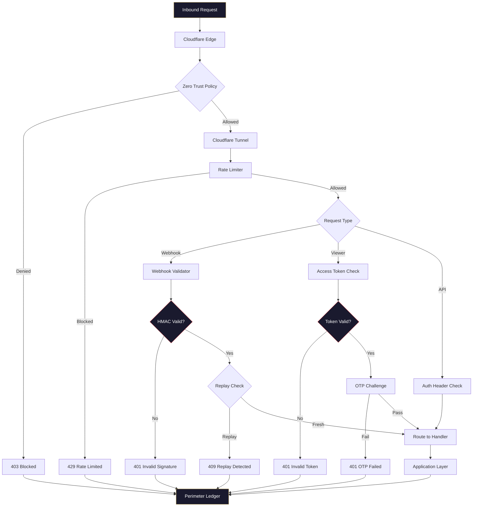

# Perimeter Flow Diagram

## Request Validation Chain



## ASCII Version

```
Inbound Request
       │
       ▼
Cloudflare Edge
       │
       ▼
┌─────────────────┐
│  Zero Trust      │
│  Access Policy   │
└───┬─────────┬───┘
    │         │
  DENY      ALLOW
    │         │
    ▼         ▼
  403    Cloudflare Tunnel
              │
              ▼
       ┌──────────────┐
       │  Rate Limiter  │
       └──┬────────┬──┘
          │        │
       BLOCKED   ALLOWED
          │        │
          ▼        ▼
        429    Request Type?
               │    │    │
            Webhook Viewer API
               │    │    │
               ▼    ▼    ▼
            HMAC  Token  Auth
            Check Check  Check
               │    │    │
          ┌────┘    │    │
          ▼         ▼    │
      Replay?    OTP?    │
       │   │    │   │    │
     REPL FRESH FAIL PASS │
       │    │    │    │   │
       ▼    └────┴────┴───┘
     409          │
                  ▼
          Application Layer
                  │
                  ▼
          Perimeter Ledger
       (all events logged)
```

## Event Types Logged

| Event | HTTP Status | Severity |
|-------|:-----------:|----------|
| Zero Trust denied | 403 | `alert` |
| Rate limit blocked | 429 | `warning` |
| Invalid HMAC | 401 | `alert` |
| Replay detected | 409 | `critical` |
| Invalid token | 401 | `warning` |
| OTP failed | 401 | `warning` |
| Validation passed | 200 | `info` |
| Request routed | — | `info` |
