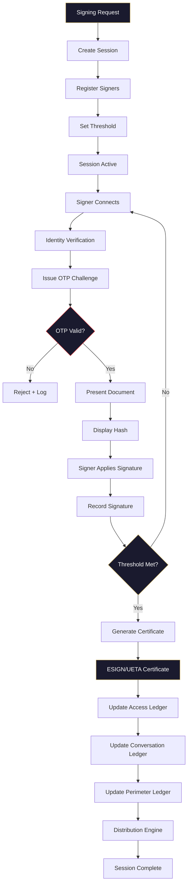

# Signing Flow Diagram

## Multi-Signature Ceremony



## ASCII Version

```
Signing Request
       │
       ▼
┌─────────────────┐
│  Create Session  │
│  Session ID      │
│  Document Hash   │
└────────┬────────┘
         │
         ▼
┌─────────────────┐
│ Register Signers │
│ Set Threshold    │
└────────┬────────┘
         │
         ▼
┌─────────────────┐
│  Session Active  │◄────────────────┐
└────────┬────────┘                  │
         │                           │
         ▼                           │
┌─────────────────┐                  │
│  OTP Challenge   │                  │
└────────┬────────┘                  │
         │                           │
    ┌────┴────┐                      │
    ▼         ▼                      │
  FAIL      PASS                     │
    │         │                      │
    ▼         ▼                      │
  Reject   Sign Document             │
    │         │                      │
    │         ▼                      │
    │    Threshold Met? ──── NO ─────┘
    │         │
    │        YES
    │         │
    │         ▼
    │   ┌─────────────────┐
    │   │  Generate Cert   │
    │   │  ESIGN/UETA      │
    │   └────────┬────────┘
    │            │
    │            ▼
    │   ┌─────────────────┐
    │   │  Log to Ledgers  │
    │   │  Access           │
    │   │  Conversation     │
    │   │  Perimeter        │
    │   └────────┬────────┘
    │            │
    │            ▼
    └──→ Session Complete
```
