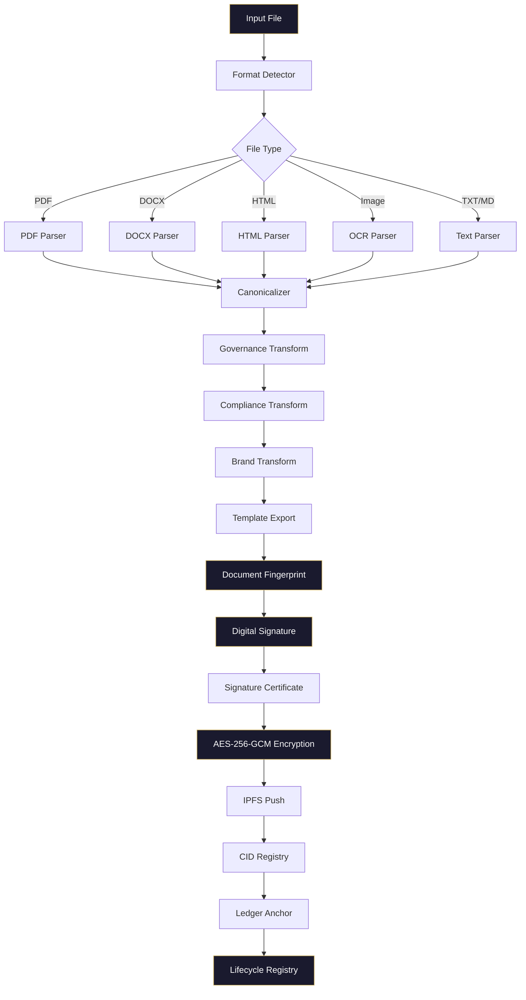

# System Flow Diagram

## End-to-End Document Lifecycle



## ASCII Version

```
Input File
    │
    ▼
Format Detector ──→ PDF Parser ──┐
                ──→ DOCX Parser ─┤
                ──→ HTML Parser ─┤
                ──→ OCR Parser  ─┤
                ──→ Text Parser ─┘
                                 │
                                 ▼
                          Canonicalizer
                                 │
                    ┌────────────┼────────────┐
                    ▼            ▼            ▼
              Governance    Compliance     Brand
              Transform     Transform    Transform
                    │            │            │
                    └────────────┼────────────┘
                                 │
                                 ▼
                          Template Export
                                 │
                                 ▼
                      Document Fingerprint
                                 │
                                 ▼
                       Digital Signature
                                 │
                                 ▼
                    Signature Certificate
                                 │
                                 ▼
                      AES-256-GCM Encrypt
                                 │
                                 ▼
                           IPFS Push
                                 │
                                 ▼
                         CID Registry
                                 │
                                 ▼
                        Ledger Anchor
                                 │
                                 ▼
                     Lifecycle Registry
```
