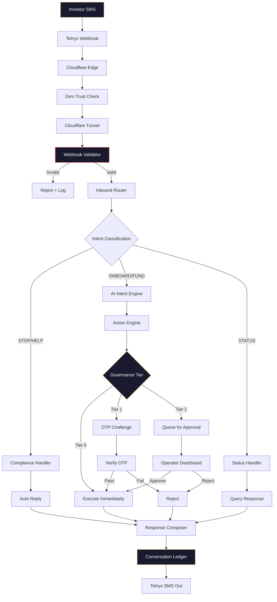

# Telecom Flow Diagram

## Inbound Message Processing



## ASCII Version

```
Investor SMS
     │
     ▼
Telnyx Webhook ──→ Cloudflare Edge ──→ Zero Trust ──→ Tunnel
                                                        │
                                                        ▼
                                                 Webhook Validator
                                                   │          │
                                              INVALID       VALID
                                                │              │
                                           Reject+Log    Inbound Router
                                                              │
                                              ┌───────────────┼───────────────┐
                                              ▼               ▼               ▼
                                         Compliance      AI Intent        Status
                                         STOP/HELP       ONBOARD/FUND     Query
                                              │               │               │
                                              ▼               ▼               ▼
                                         Auto Reply     Action Engine    Query Resp
                                              │               │               │
                                              │          ┌────┼────┐          │
                                              │          ▼    ▼    ▼          │
                                              │        T0   T1   T2          │
                                              │        Auto OTP  Manual      │
                                              │          │    │    │          │
                                              └──────────┴────┴────┴──────────┘
                                                              │
                                                              ▼
                                                     Response Composer
                                                              │
                                                              ▼
                                                    Conversation Ledger
                                                              │
                                                              ▼
                                                       Telnyx SMS Out
```
